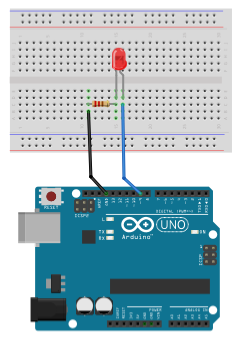
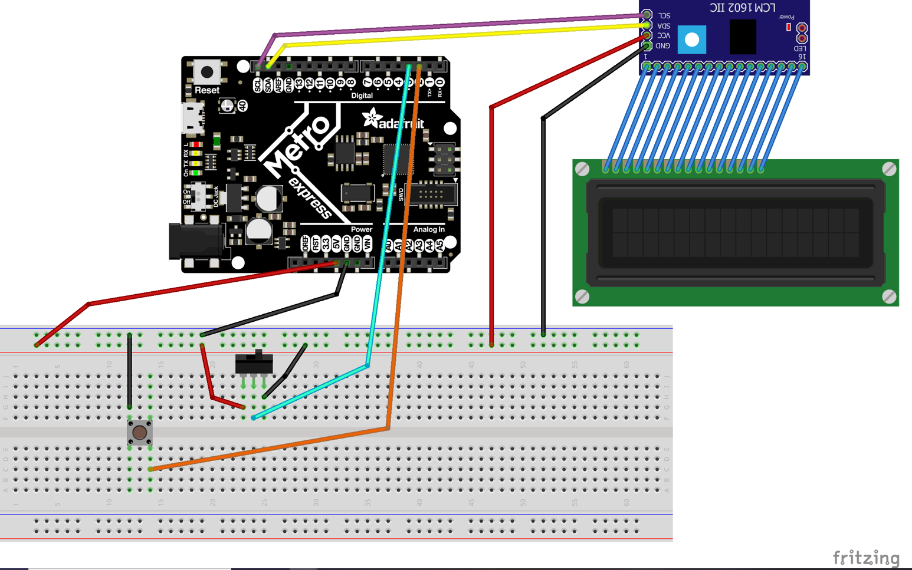
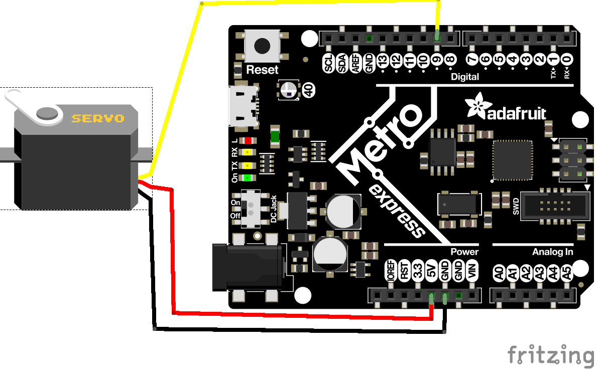
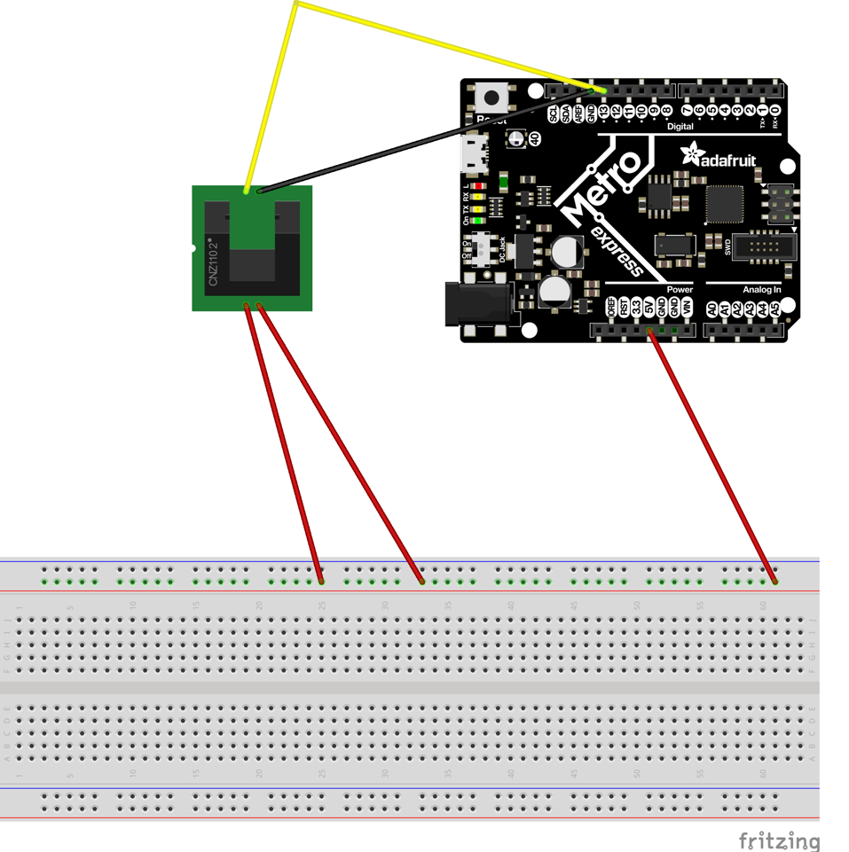
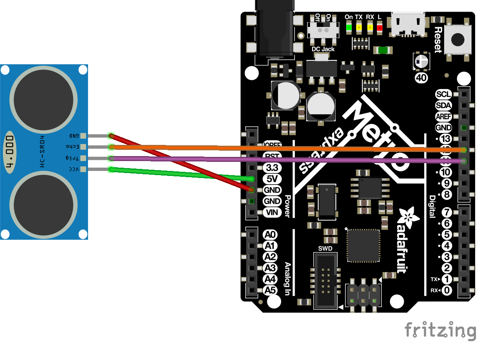
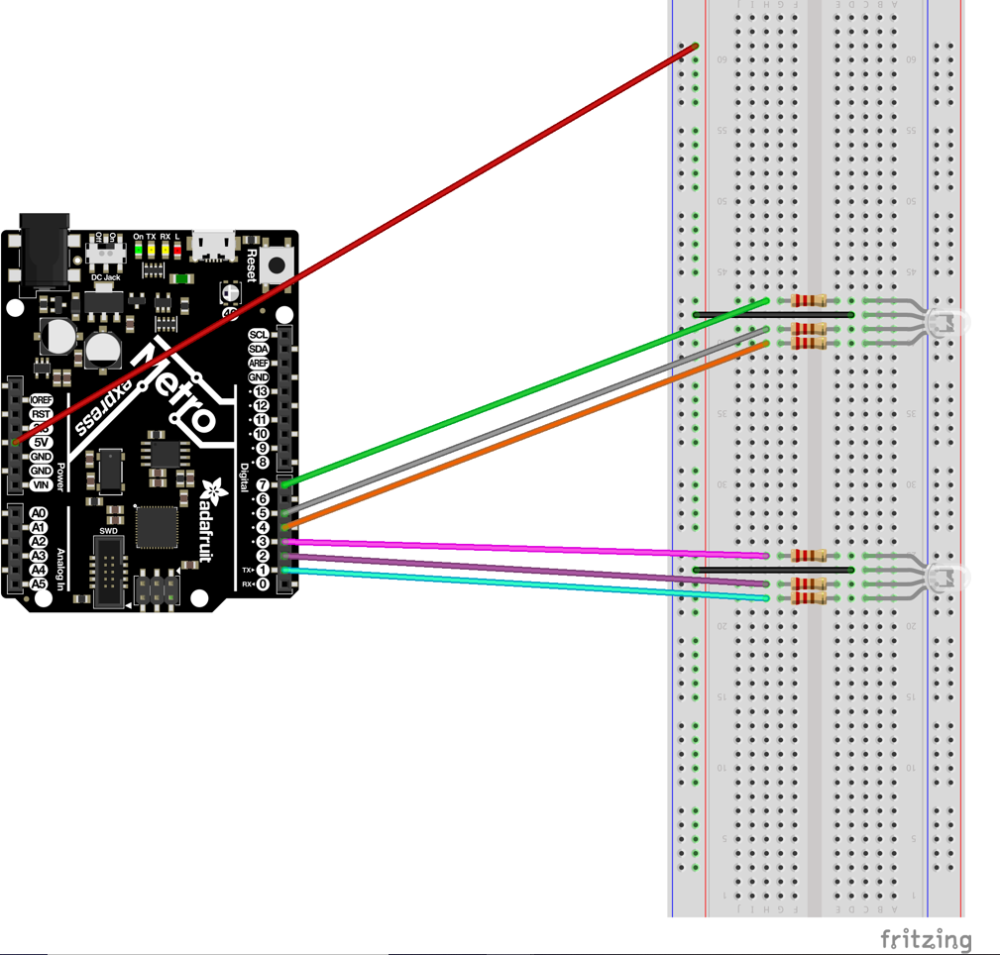
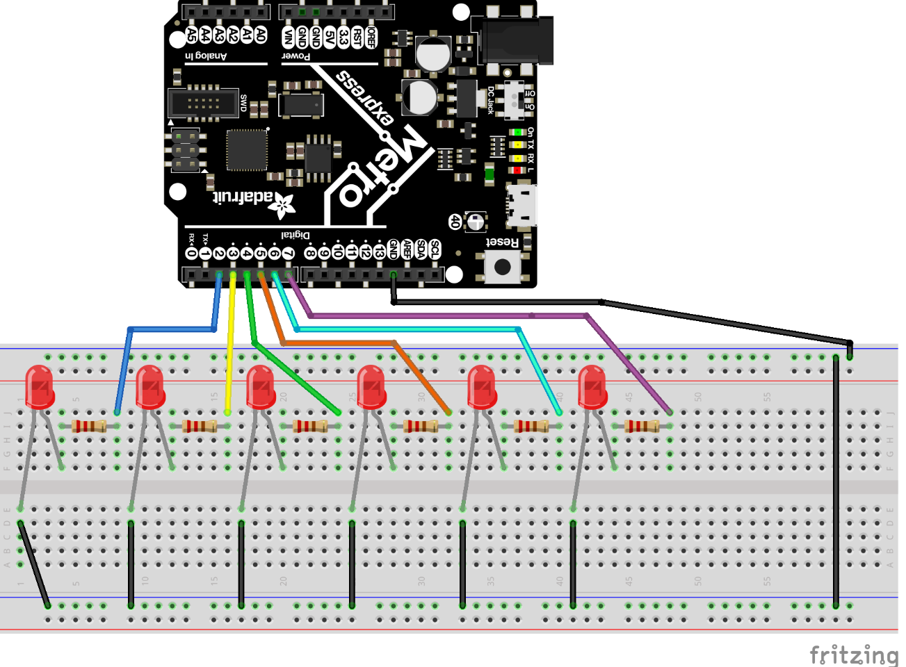

# CircuitPython

## Table of Contents
* [Table of Contents](#Table-of-Contents)
* [LED Fade](#LED-Fade)
* [LCD](#LCD)
* [Servo](#Servo)
* [Photo Interrupter](#Photo-Interrupter)
* [Distance Sensor](#Distance-Sensor)
* [Classes, Objects, and Modules](#Classes-Objects-and-Modules)
* [Hello vs Code](#Hello-VSCode)
* [Fancy LED](#Fancy-LED)

## LED Fade
### Description
In Fade Led I made an LED blink and fade in and out using the metro board
### Picture/Diagram

[Picture credit goes to Graham Lenert](https://github.com/glenert41/CircuitPython)
### Problems and Lessons Learned
My biggest problem during this assignment was using led.duty_cycle. I looked it up to understand it more and because of that I know wnow what it means and how to use it

## LCD
### Description
In the LCD assignment I used an LCD to count how many times I had presssed a button. I got it to say "Button Presses: __" This number went up by one every time I pressed the button
### Picture/Diagram

[Picture credit goes to Graham Lenert](https://github.com/glenert41/CircuitPython)
### Problems and Lessons Learned
My main problem in this assignment was getting the lcd to print a variable. After a lot of googling, i founf out how to do it using "button presses as a variable". In this assignment I learned how to use an lcd with circuitpython and I learned how to use a button as well.

## Servo
### Description
In the Servo assignment I made a servo spin a certain direction by pushing on wires. If i presssed one wired it went clockwise, and if I pressed the other wire it went counter clockwise. Each wire when touched made the servo spin 180% in a different direction
### Picture/Diagram

[Picture credit goes to Graham Lenert](https://github.com/glenert41/CircuitPython)
### Problems and Lessons Learned
i had a lot of trouble with activating the servo using touch in this assignment. I learned that You can use the A pins to use touch. I also larned how to code for a servo using circuitpython.

## Photo Interrupter
### description
I the Photo Interrupter assignment I printed how many times my photo interrupter had been interrupted. I also made it so it counted every four second and restarted after 4 seconds.i had to do this without using time.sleep It printed the interrupts per 4 seconds into the serial monitor. 
### Picture/Diagram

[Picture credit goes to Graham Lenert](https://github.com/glenert41/CircuitPython)
### Problems and Lessons Learned
In this assignment I first ran into the problem that my code didn't just count once for each interrupt and it would count infinitley until it was uninterrupted. i was able to fix this by making it so it only counted if the last state was false meaning that it was not interrupted right before. After this I had to figure out the time problem. I had to do a lot of googling but eventually I found code that would help. This code made it so it counted the interrrupts until the time got to four seconds. When it got to this point I had a line that set the value back to zero.  

## Distance Sensor
### Description
In the Distance Sensor assignment I made the led on the metro board change colors using a distn=ance sensor. I made it so the led was red at 5 cm but slowly turned into pink as the distance increased. This pink then slowly turned into blue at 20cm. This blue then turned to light blue and then to green at 35cm. It also printed the distance in the serial monitor.
### Picture/Diagram

[Picture credit goes to Graham Lenert](https://github.com/glenert41/CircuitPython)
### Problems and Lessons Learned
I ran into a problem trying to find out how to make the colors change with distance. To do this I had to use a map range to make it so between two distance intervals, you gained or lost either r, g, and b. I had some trouble getting the colors to be in the right order just because I didn't really understancd it well, but after looking at pictures of rainbows I began to understand it more.

## Classes Objects and Modules
### Description
In the Classes. Objects, and Modules assignment I used a class to make an led change colors by just putting the color in the code. I also made it go through the colors of the rainbiw at two different speeds just using the word rainbow. I did this by adding these codes to the class and then just calling on it to make it run the code.
### Picture/Diagram

[Picture credit goes to Graham Lenert](https://github.com/glenert41/CircuitPython)
### Problems and Lessons Learned
My first problem I ran into was how to name everything in this assignment. With help from Mr.H i learned about using self to name all the variables. After this I ran into the problem that all my colors were wrong. I looked it up and it turned out that for rgb leds you just have to code them opposite. The main thing I learned in this assignment was how to make classes so i can use whole sections of code by just saying the name of the module or class.

## Hello VSCode
### Description
In the hello_vs_code assignment I learned to use VS and how to add and commit through VS instead of git bash.
### Picture/Diagram
### Problems and Lessons Learned
I didn't really have any problems in this assignment. I did learn about how to use VScode and how it is so much easier than using arduino because it is linked directly to your git. 

## Fancy LED
### Description
In the fancyLed assignment I had to use two sets of 3 leds. The first set alternated and then did a chase. The second set blinked and then sparkled. For the sparkle I used random to make it som random lights would turn on. I then made it so my chase went through all leds instead of just the first 3. 
### Picture/Diagram

[Picture credit goes to Graham Lenert](https://github.com/glenert41/CircuitPython)
### Problems and Lessons Learned
in this assignment I knew how to make the classes and module because of what I learned in a previous assignment. the main problem I ran into was making the lights sparkle. To do this I made a random nuber generator basically. I made code that randomly picked a number and each number made it do a different set of code. Each set of code made different lights turn on. i learned in this assignment how to make code randomized.
